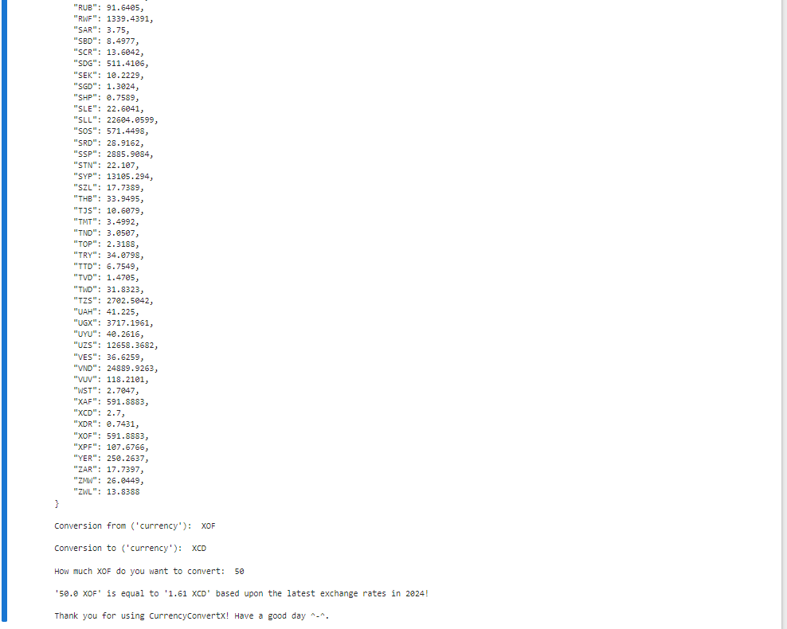

#  Currency Converter X
## Description
Crafted a Currency Convert, an intuitive currency converter that effortlessly integrates real-time exchange rates,
delivering precise and up-to-date calculations and by integrating Python's inbuilt functions and leveraging libraries like NumPy and cutting the code complexity by 50%.

## Screenshots
 

     
     

## Tech Stack

